# Azure API Management

API Management is a Azure service for abstracting your back-end services(Web App, Logic and Function App) and presenting a set of API’s via a single HTTPs endpoint.

API Management offers 3 types of Services
  - Developer Portal
  - API Gateway
  - Publisher Portal

# Features

  - API Documentation
  - Monitoring
  - API Versioning
  - API Security
  - API Policy
  - User Roles
  - Mock API Response

# Pricing

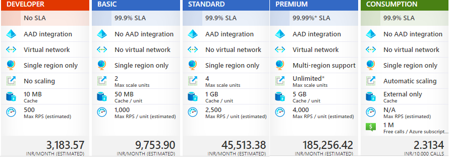

see [Pricing Details](https://azure.microsoft.com/en-us/pricing/details/api-management/)
# How To Create API Management Instance

```sh
Home > API Management services > Create API Management services
```

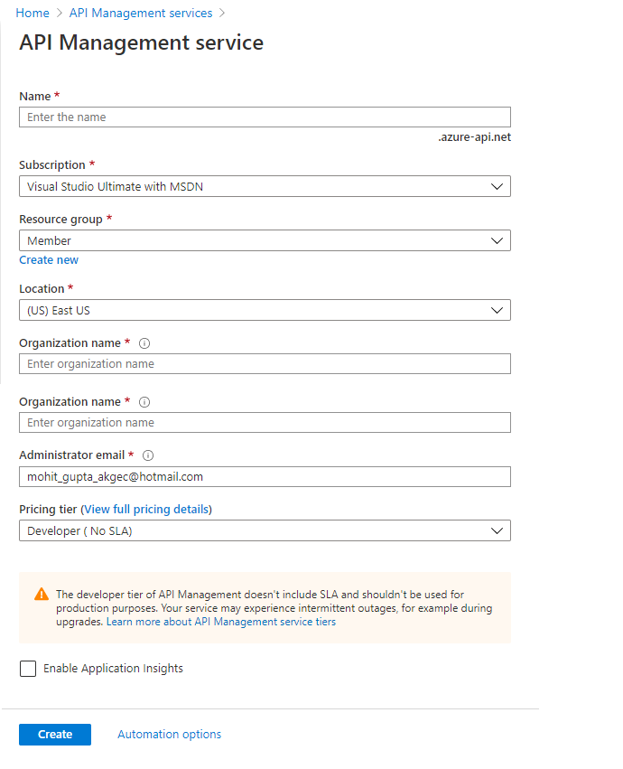

# How to Import Existing Swagger API 

Create API in API Management using Existing  OpenAPI Specification as Backend API

For Example , I have existing API with swagger hosted at [Uri](https://conferenceapi.azurewebsites.net/?format=json)

```sh
Home > API Management services > APIM Instance > Export Template
```
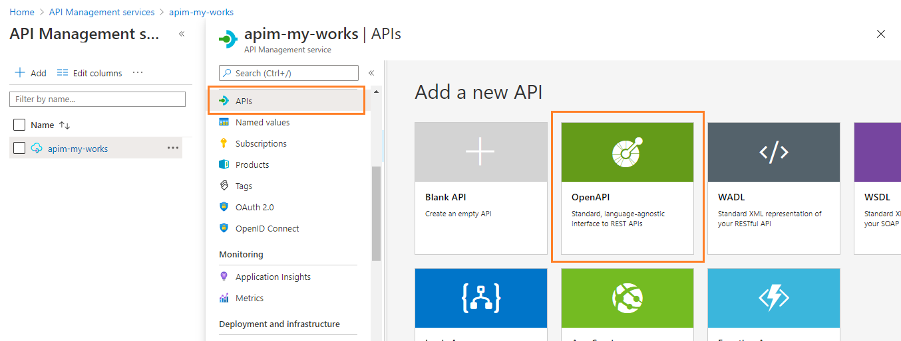

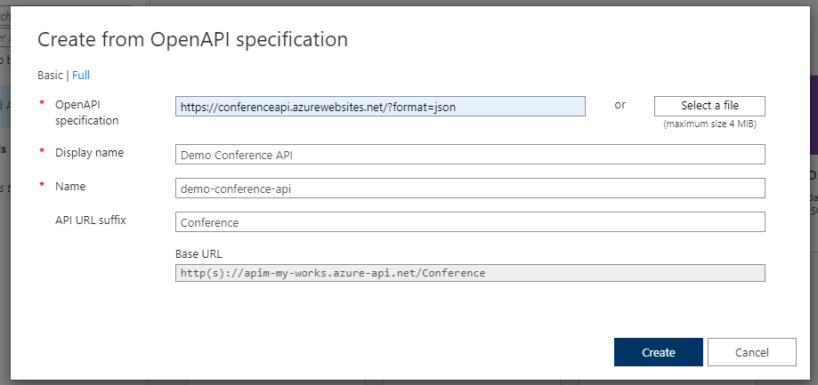

# How to Mock API Response

Mock API Response is required when the API façade is designed first and the backend implementation comes later. Or, the backend is being developed in parallel.

### Create Blank API

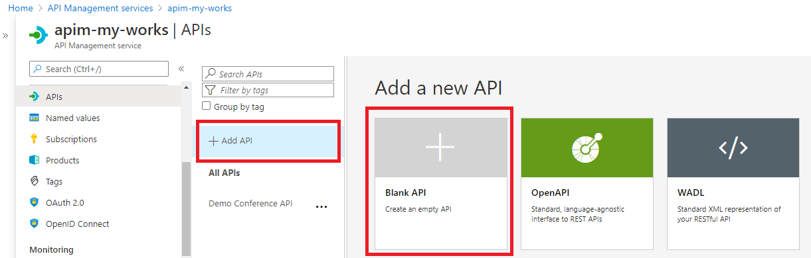

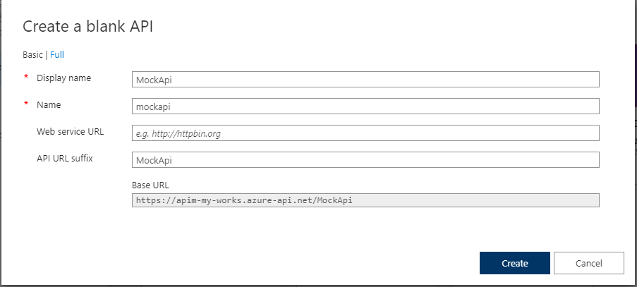

### Create Mock Operation

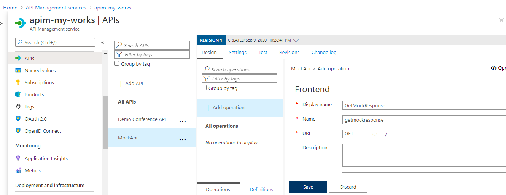

### Add Mock Policy 

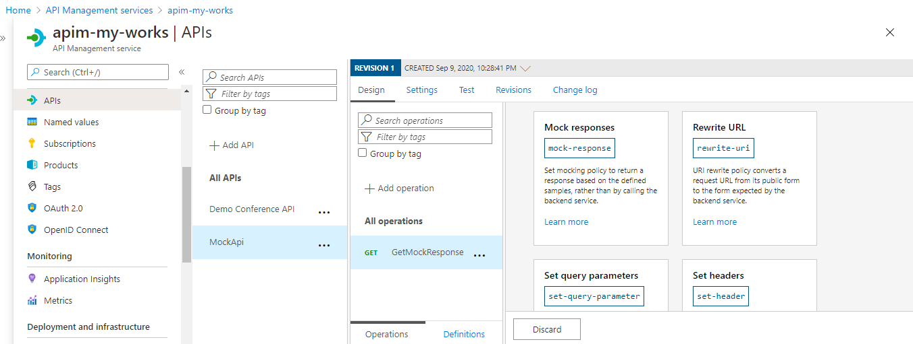

# How to Secure API in APIM using O-Auth 2.0 

### Create Two application in Azure Active Directory

  - Conference API Client
  - Conference API

Create Application for Conference API

```sh
Azure Active Directory > App Registration > New Registration
```
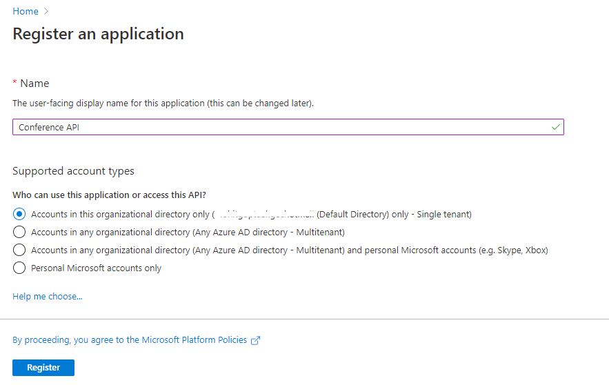

Expose API Scope 

```sh
Azure Active Directory > Conference API  > Expose An API
```
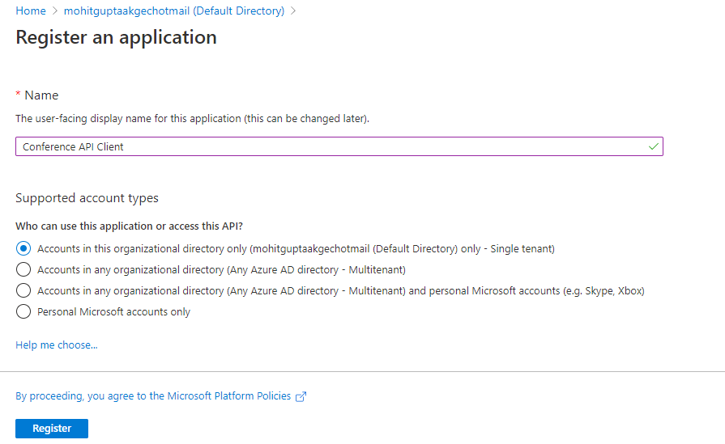

Create O-Auth Scope for API 

```sh
Azure Active Directory > Conference API  > Manifest
```

Edit Manifest file 

```sh
{
			"allowedMemberTypes": [
				"Application"
			],
			"description": "Apps that have this role have the ability to invoke my API",
			"displayName": "Can invoke my Conference API",
			"id": "9575c6e3-7339-4ad6-ad0e-01e5b89326a9",
			"isEnabled": true,
			"lang": null,
			"origin": "Application",
			"value": "conferenceApi"
		}
```

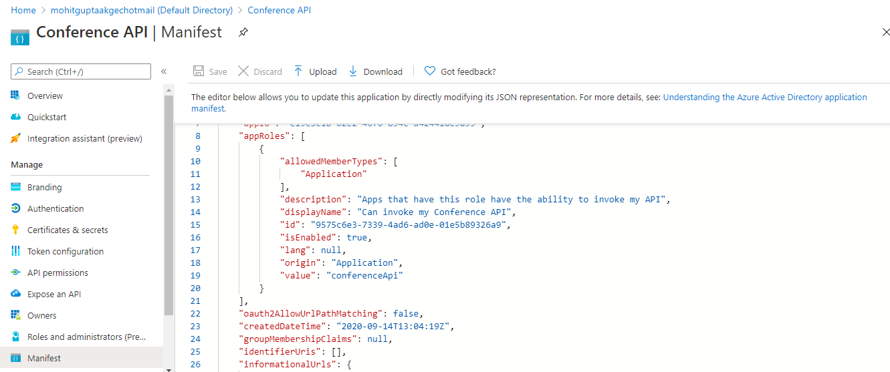

Create Application for Conference API Client

```sh
Azure Active Directory > App Registration > New Registration
```

Give permission to This application to access scope of Conference API application

```sh
Azure Active Directory > Conference API Client  > API Permission
```

Add Secret to Client application
```sh
Azure Active Directory > Conference API Client  > Certificates & secrets
```

Add Validate JWT Policy at API Operations

```sh
<validate-jwt header-name="Authorization" failed-validation-httpcode="401" failed-validation-error-message="Unauthorized" require-expiration-time="true" require-scheme="Bearer" require-signed-tokens="true" clock-skew="0">
    <openid-config url="https://login.microsoftonline.com/{Tenant ID}/.well-known/openid-configuration">
    <required-claims>
        <claim name="aud" match="any">
            <value>api://{Application ID of Conference API}</value>
			<value>{Application ID of Conference API}</value>
        </claim>
    </required-claims>
</validate-jwt>
```

### Fetch Access Token

### Call API using Bearer Token in Authorization Header

# How to Deploy API Management using ARM Template

```sh
Home > API Management services > APIM Instance > Export Template
```

```sh
{
   "$schema":"https://schema.management.azure.com/schemas/2015-01-01/deploymentTemplate.json#",
   "contentVersion":"1.0.0.0",
   "parameters":{
      "apimcapacity":{
         "type":"int",
         "defaultValue":0
      },
      "apimname":{
         "type":"string",
         "defaultValue":"apim-my-works"
      }
   },
   "variables":{ },
   "resources":[
      {
         "type":"Microsoft.ApiManagement/service",
         "apiVersion":"2019-01-01",
         "name":"[parameters('apimname')]",
         "location":"[resourceGroup().location]",
         "sku":{
            "name":"Consumption",
            "capacity":"[parameters('apimcapacity')]"
         },
         "properties":{
            "publisherEmail":"mohit_gupta_akgec@hotmail.com",
            "publisherName":"my-works"
         }
      }
   ],
   "outputs":{}
}
```
