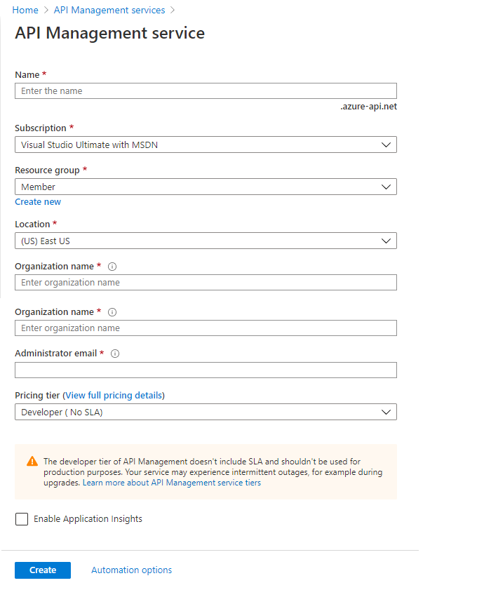

# Azure API Management

API Management is a Azure service for abstracting your back-end services(Web App, Logic and Function App) and presenting a set of API’s via a single HTTPs endpoint.

API Management offers 3 types of Services
  - Developer Portal
  - API Gateway
  - Publisher Portal

# Features

  - API Documentation
  - Monitoring
  - API Versioning
  - API Security
  - API Policy
  - User Roles
  - Mock API Response

# Pricing


see [Pricing Details](https://azure.microsoft.com/en-us/pricing/details/api-management/)
# How To Create API Management Instance

```sh
Home > API Management services > Create API Management services
```



# How to Deploy API Management using ARM Template

```sh
Home > API Management services > APIM Instance > Export Template
```

```sh
{
   "$schema":"https://schema.management.azure.com/schemas/2015-01-01/deploymentTemplate.json#",
   "contentVersion":"1.0.0.0",
   "parameters":{
      "apimcapacity":{
         "type":"int",
         "defaultValue":0
      },
      "apimname":{
         "type":"string",
         "defaultValue":"apim-my-works"
      }
   },
   "variables":{ },
   "resources":[
      {
         "type":"Microsoft.ApiManagement/service",
         "apiVersion":"2019-01-01",
         "name":"[parameters('apimname')]",
         "location":"[resourceGroup().location]",
         "sku":{
            "name":"Consumption",
            "capacity":"[parameters('apimcapacity')]"
         },
         "properties":{
            "publisherEmail":"mohit_gupta_akgec@hotmail.com",
            "publisherName":"JK-Tech"
         }
      }
   ],
   "outputs":{}
}
```
