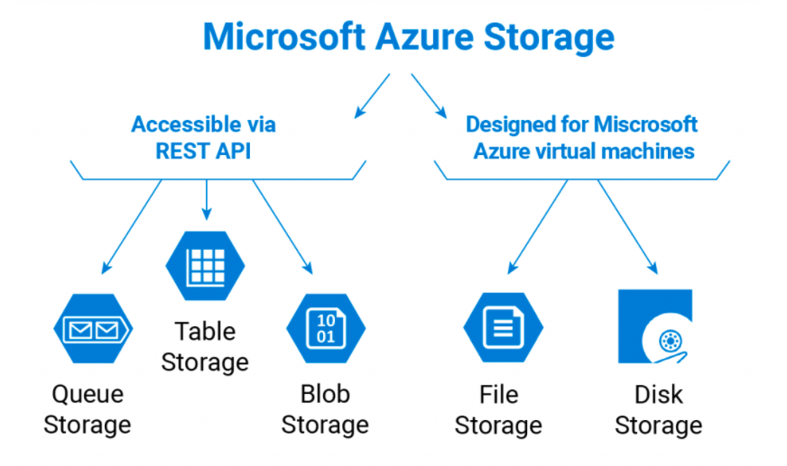
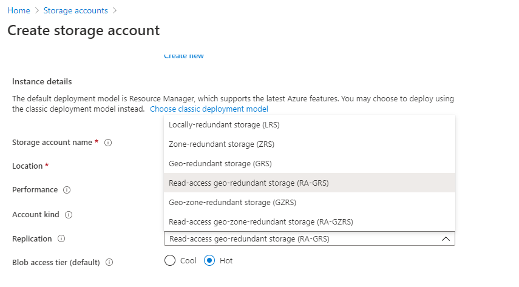

# Azure Storage Account

Microsoft Azure Cloud offers several types of scalable, high-availability storage: for tables, queues, files, blobs, and Azure virtual machine disks

# Redundancy

| Type | Description |
| ------ | ------ |
| Locally redundant storage (LRS) | Keeps multiple copies of your data in one data center. |
| Zone redundant storage (ZRS) | Keeps multiple copies of your data in different data centers in different regions. |
| Geo-redundant storage (GRS)	 | Holds multiple copies of your data in one region and replicates the data to the second region, asynchronously. |
| Read-access geo-redundant storage (RA-GRS) | Allows read access from the second region, which is used for GRS, and the read availability is 99.99% |
|Geo-zone-redundant storage (GZRS)|Copies your data synchronously across three Azure availability zones in the primary region using ZRS|
|Read Access Geo-zone-redundant storage(RA-GZRS)|Exposes a read endpoint on this secondary replica allowing you to read data in the event of primary region unavailability|

# Types
- Blob Storage  
- Table Storage
- Queue Storage
- Disk Storage

##### Blob Storage
‘Blob’ stands for Binary Large Object and includes text files, images, audios, and videos. Azure Blob is a service that stores massive unstructured data that can be accessed from any place via protocols like HTTP or HTTPS.
>This is the most basic and the cheapest way to store your files in Azure.

There are three types of blobs

- *Block Blobs* - When you store a file in block blob - that means that it arrives on the storage in small parts and only after you complete the upload - the file/blob puts itself together in one piece. With that architecture, file cannot be modified without a complete re-upload. This is the most basic and the cheapest way to store your files in Azure.
- Append Blobs-You cannot change the Block Blob without re-uploading it. However, there are situations, when you need to update the file on a regular basis. Append Blobs were created just for that purpose - they are structured in such a way, so the user can upload parts of the files from the end.
- Page Blobs - Page Blobs are the basis for Microsoft Azure virtual machines environment. They were specifically designed to meet the restrictions for disks - each Page Blob should be multiple to 512 bytes. The architecture of Page Blobs allows writing data to each part of the blob.

##### Queue Storage

Queue Storage is a type of storage designed to connect components of your application. It allows you to build flexible applications with decoupled and independent components that rely on asynchronous message queuing.

##### Table Storage
Table storage can store, you guessed it, tables. Microsoft Azure Table Storage was designed to store structured NoSQL data. The storage is hugely scalable and, at the same time, cheap to keep data in. 
It is schemaless, i.e., the data does not have a fixed structure. You can easily store datasets that do not require any joins or foreign keys. You can denormalize them to make quicker access. You can scale up the tables based on your requirements.

##### Disk Storage
Microsoft Azure Disk Storage works on the basis of Page Blobs. It is a service that allows you to create disks for your virtual machines. The disk, created in Disk Storage, can be accessed from only one virtual machine. In other words - it is your local drive.
They are accessible via SMB.
