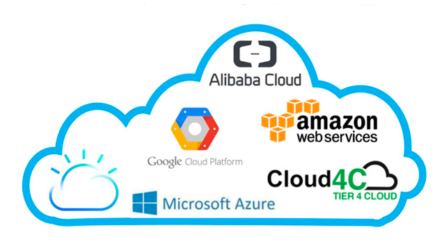
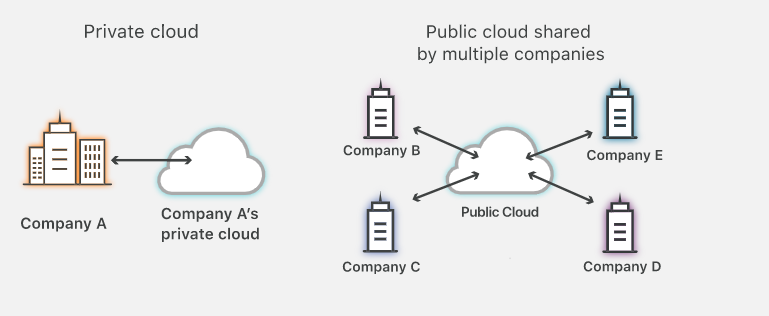

# Cloud Computing

cloud computing is the delivery of computing services . From applications to storage and processing power -- typically over the internet and on a pay-as-you-go basis.

### Benefits
- Cost
- Speed
- Productivity
- Global scale
- Security
- Reliability

### Types of Cloud Computing
- **Public cloud** : Public clouds are owned and operated by a third-party cloud service providers, which deliver their computing resources like servers and storage over the Internet. Microsoft Azure is an example of a public cloud. With a public cloud, all hardware, software and other supporting infrastructure is owned and managed by the cloud provider. You access these services and manage your account using a web browser.
- **Private cloud** : A private cloud refers to cloud computing resources used exclusively by a single business or organisation. A private cloud can be physically located on the company’s on-site datacenter. Some companies also pay third-party service providers to host their private cloud. A private cloud is one in which the services and infrastructure are maintained on a private network.

- **Hybrid cloud** : Hybrid clouds combine public and private clouds, bound together by technology that allows data and applications to be shared between them. By allowing data and applications to move between private and public clouds, a hybrid cloud gives your business greater flexibility, more deployment options and helps optimise your existing infrastructure, security and compliance.

### Types of cloud services
- **IAAS** - With IaaS, you rent IT infrastructure—servers and virtual machines (VMs), storage, networks, operating systems—from a cloud provider on a pay-as-you-go basis.
- **PAAS** - Supply an on-demand environment for developing, testing, delivering and managing software applications. PaaS is designed to make it easier for developers
- **SAAA** - Software as a service is a method for delivering software applications over the Internet . The variety of applications delivered via SaaS is huge, from CRM such as Salesforce through to Microsoft's Office 365.
- **Serverless** -Serverless computing focuses on building app functionality without spending time continually managing the servers and infrastructure required to do so
