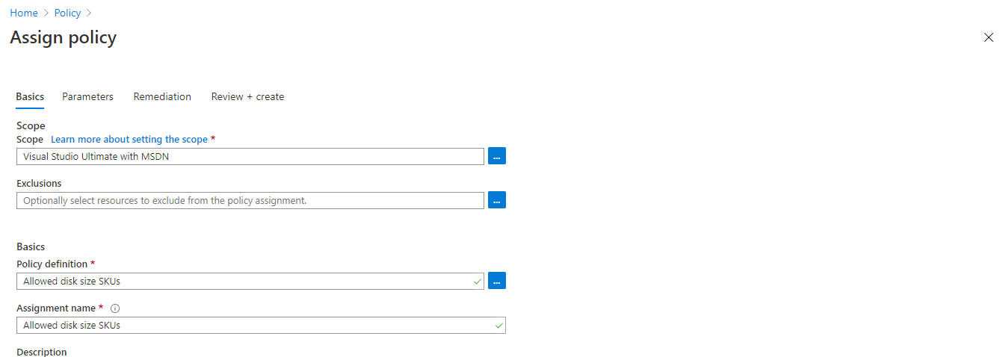
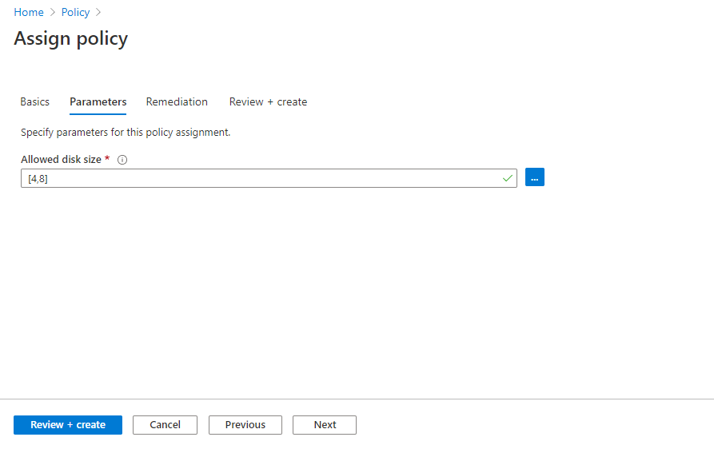
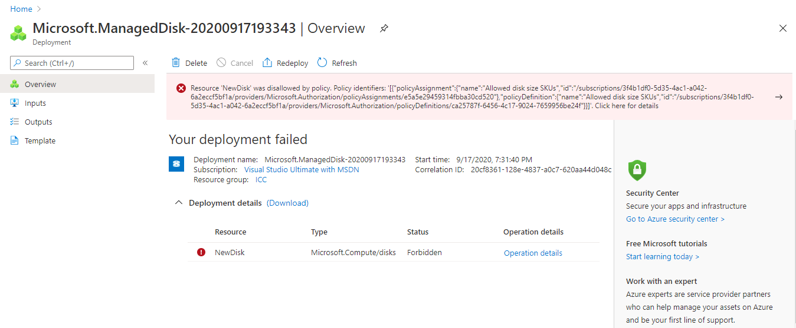

### Introduction to Azure Policy

Azure Policy is the set of rules we can enforce over azure resources .

> An Organisation need to make sure all their Azure resources are deployed under west us region.

> Restrict disk size between 4 - 64 GB to prevent cost 

> Restrict developer to create Virtual Machine with sku's B1s , B1ls

It can prevent the creation of disallowed resources, ensure new resources have specific settings applied .

Azure policy is basically 3 components; policy definition , assignment and parameters.

### Azure Policy Defination 

Policy defination is set of logical expression (What to evaluate and what action needs to be taken)

```sh
{
         "if": {
            "allOf": [
               {
                  "field": "type",
                  "equals": "Microsoft.Compute/virtualMachines"
               },
               {
                  "not": {
                     "field": "Microsoft.Compute/virtualMachines/sku.name",
                     "in": "[parameters('listOfAllowedSKUs')]"
                  }
               }
            ]
         },
         "then": {
            "effect": "Deny"
         }
      }
```

##### logical operators supported 

         * not
         * allOf
         * anyOf

##### Condition type supported

         * equals
         * notEquals
         * like
         * notLike
         * match
         * notMatch
         * contains
         * notContains
         * in
         * notIn
         * containsKey
         * notContainsKey
         * exists

##### Effects type supported

         * Deny
         * Audit
         * Append 
         * AuditIfNotExists 
         * DeployIfNotExists 

### How to create custom Azure Policy

In This Example , We will create a policy to allow  the use of Disk size with 4 GB , 8 GB only

```sh
Home > Policy > Policy Defination
```

```sh
{
  "mode": "All",
  "policyRule": {
     "if": {
         "not" :{
              "field": "Microsoft.Compute/disks/diskSizeGB",
              "in": "[parameters('listOfAlloweddiskSize')]"
               }
    },
    "then": {
      "effect": "deny"
    } 
  },
  "parameters": {
    "listOfAlloweddiskSize": {
      "type": "Array",
      "metadata": {
        "description": "The list of allowed disk size for resources.",
        "displayName": "Allowed disk size"
      }
    }
  }
}
```


### How to assign on azure resource group or Azure Subscription

```sh
Home > Policy > Assign Policy
```



Assign parameter 




### How to test 

Create disk of size 1024 GB . It will raise error while deploying 



### How it is different from RBAC 

Role-based Access Control is about limiting which users can do what. 
Azure Policy is about limiting what actions can and cannot be taken.
It doesn’t really care about what kind of user you are; if the Policy says you can’t open a certain port to the world, then you can’t. 
