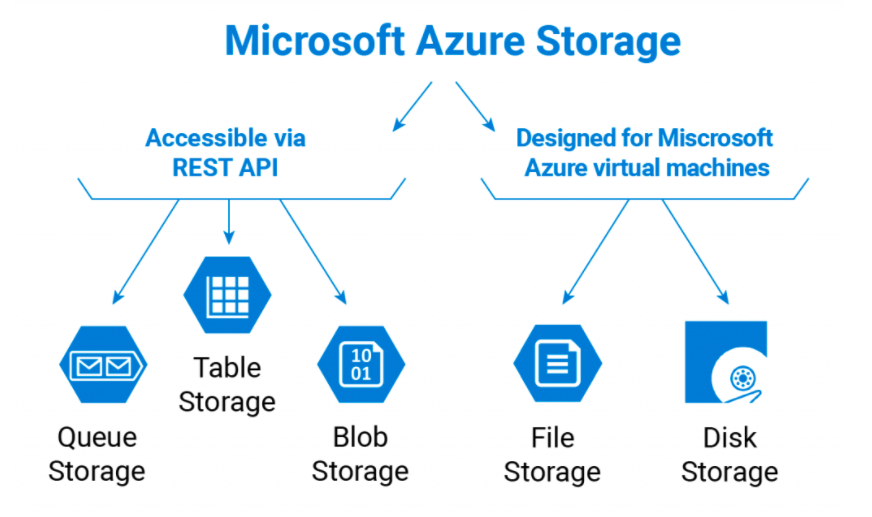

# Azure Storage Account

Microsoft Azure Cloud offers several types of scalable, high-availability storage: for tables, queues, files, blobs, and Azure virtual machine disks

# Types
- Blob Storage  
- Table Storage
- Queue Storage
- Disk Storage

